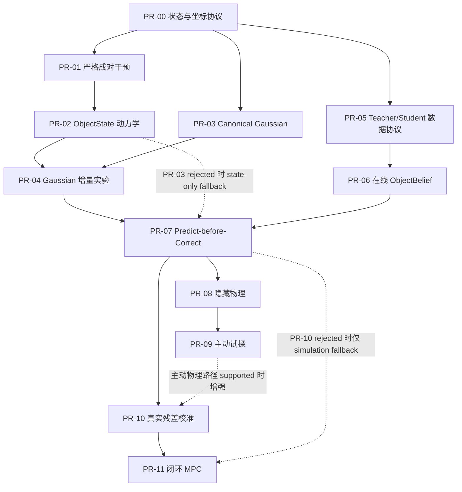

# ObjGauss 假设驱动实施路径

> 状态：Stage-0、`PR-00` 与 PR-01A–F 已提交；PR-01 implementation HEAD 的 clean 一键验收
> 已本地支持，最终提交 SHA 的远端 CI 待运行
> 版本：0.13
> 日期：2026-07-14
> 上位需求：`PRD.md`
>
> 知识状态：
>
> - `decision`：实现 PR 按“一个 PR 只引入一个可证伪假设”拆分，不按数据集拆分。
> - `decision`：`PR-04` 是 Gaussian 是否进入 dynamics 核心的生死门。
> - `decision`：首个验收目标是面向研究评审的 Demo A；必须接受 `PR-04` 的支持或否定结论。
> - `decision`：`PR-04` 的唯一 primary endpoint 是 held-out sibling groups 上的多步
>   `effect-vs-hold` ObjectState 预测误差。
> - `decision`：该 endpoint 使用 group-first paired aggregation；每个 sibling group 等权，
>   不能让 episode 长度或非目标对象数量隐式改变裁决权重。
> - `decision`：稳定增益要求相对两个非 Gaussian 基线的 paired hierarchical bootstrap
>   95% 置信区间下界都超过预先冻结的最小实际增益 `δ`。
> - `decision`：`δ` 由与最终 test 完全隔离的 pilot 估计 evaluator 噪声和跨 seed 波动后
>   冻结；pilot 不进入最终统计，最终结果可见后不得调整 `δ`。
> - `decision`：多步 horizon 按物理时间覆盖动作执行和固定 post-action settling，不使用
>   simulator steps；具体时长和评分点由与最终 test 隔离的 pilot 冻结。
> - `decision`：`PR-04` primary endpoint 只使用 `hold + push` cohort；`grasp/lift` 使用
>   duration-matched hold，作为独立 secondary cohort。
> - `decision`：primary error 覆盖位置、按对象对称性校正的朝向、线速度和角速度；各分量
>   使用独立 pilot 产生的尺度归一化并冻结权重。
> - `decision`：每类状态误差除以 pilot robust scale 与 evaluator noise floor 的较大者；
>   归一化后位置、朝向、线速度和角速度各占 primary scalar 的 25%。
> - `decision`：多对象场景的 primary endpoint 只评估 `Intervention.target_id` 指向的直接
>   干预对象；其他对象的碰撞传播和 collateral effects 只作 secondary metrics。
> - `decision`：final test 完整留出 object identities、scene layouts 及其 sibling groups；
>   push 类型、方向和力度范围在 train 中有覆盖，不把 action extrapolation 混入主裁决。
> - `decision`：held-out 对象的 Gaussian 与 point cloud 共享同一冻结的 pre-intervention
>   多视角 oracle context、原始证据和采样预算；禁止 post-action/future 信息。
> - `decision`：`PR-03` builders 按版本/hash 冻结并离线生成 artifacts；`PR-04` 使用容量匹配
>   adapters 和相同 dynamics backbone，梯度不得回传 builders。
> - `decision`：三个 primary arms 匹配总可训练参数量、数据曝光、optimizer updates、batch
>   policy 和调参预算；FLOPs、显存与延迟报告但不强制相等。
> - `decision`：在继续 grill-me 前先交付直接渲染 3D Gaussian 的 Stage-0 页面，不使用
>   notebook，并允许下载 REFERENCES.md 登记的固定小型 `.splat`；该切片不计作 `PR-00`
>   contract、训练结果或研究 verdict。
> - `decision`：Stage-0 只做 Web，并以可自由浏览的环境级 Gaussian scene 为默认体验；不得用
>   单物体加假地面网格包装成“世界”，也不得伪造 `PR-00` episode、坐标轴或轨迹。
> - `confirmed_fact`：Stage-0 已由提交 `c1927b1` 固化；ignored 外部审计样例没有进入 Git。
> - `decision`：`PR-00` 使用固定 seed/config 的仓库内 JavaScript producer 生成
>   `synthetic-audit-v0`，不下载外部数据，也不读取旧归档。
> - `confirmed_fact`：`PR-00` 由提交 `b4107fa` 固化；本地 `npm run check` verdict 为
>   `supported`，36 个 primary points 的最大重投影误差为 `1.005e-14 px`，资源/lineage 与
>   14 类预注册负例通过。远端 CI 尚未运行，下游假设也未因此支持。
> - `confirmed_fact`：ManiSkill `3.0.1` 的官方 release、PyPI wheel/hash、许可、snapshot/reset
>   和平台要求已由 RES-001 核验。CPython 3.12 的 `A-0` 因 `toppra` 无匹配 wheel 在解析阶段
>   失败；CPython 3.10.20 的 `A-1` 已通过安装、import 和宿主 GPU probe。Snapshot pilot 的
>   五 sibling full hash 与两次进程 evidence hash 均一致；上游 state-only restore 不包含 RNG，
>   显式 RNG capture/restore 是 PR-01 adapter 的强制责任。随后 programmatic CPU primitive
>   external-force action/contact pilot 也通过 canonical/reverse 两个独立进程，ManiSkill 因此为
>   `approved_pr01_primitive_cpu_push_source`，但不是完整 approved simulator。
> - `decision`：PR-01 是一个验收里程碑，内部按 Contract、Runtime、Writer、Independent Audit、
>   Cohort、Delivery 六个独立切片推进；Independent Audit 必须先于正式 cohort。
> - `decision`：PR-01 使用 `0.2.0` episode、experiment、attempt、invariance-report 四层 contract；
>   `0.1.0` 字节冻结，精确版本分派，禁止 `latest`、静默升级或自动迁移。
> - `decision`：production simulator 使用隔离 `sim` optional extra，只允许 primitive 离线生成、
>   adapter/writer/smoke/CI；独立 auditor 不依赖 ManiSkill 或 writer。禁止 RGB/GPU renderer、
>   外部 asset、训练、模型、Gaussian dynamics 和机器人控制。
> - `decision`：PR-01 Demo 使用无 RGB 五联状态回放，只消费已审计 episode；machine report 是
>   验收事实源。
> - `working_assumption`：HO-Cap、RH20T 等具体来源，分支名、建议源码路径、
>   模型家族和未冻结数值阈值；`RES-001` 可以用更合适的获批来源替换。
> - 当前本地实现包括 Stage-0、`PR-00`、独立 RES-001 snapshot audit tool、PR-01 primitive
>   sibling action/contact gate 与 PR-01A–F contract/runtime/writer/audit/cohort/Delivery；PR-01A–F
>   已由 `71d4e39` 提交并在该 clean HEAD 上完整验收为 `supported`。本文不表示
>   远端 CI、完整 PR-01 关闭或模型已实现，也不表示
>   `PR-01`–`PR-11` 已创建、提交或通过。

## 1. 路径结论

数据集是证据来源，不是 PR 的所有权边界。每个实现 PR 必须回答一个能被实验否定的问题：

1. 假设是什么；
2. 什么观察会支持或否定它；
3. 使用什么简单基线与固定拆分；
4. 失败后停止、降级还是改走哪条路径；
5. 哪个可复现 Demo 让结果可观察。

每个 PR 在实现前冻结一个 primary endpoint 和裁决方向；secondary metrics 用于解释机制，
不能在 primary endpoint 失败后临时改成“成功依据”。

`PR-00` 到 `PR-11` 的依赖关系如下：



`PR-04` 的结果只决定 Gaussian 的职责，不决定项目是否整体停止：

- 有稳定增益：Gaussian feature 可以进入后续 dynamics。
- 无稳定增益：保留 `PR-03`，将 Gaussian 固定为视觉记忆与 renderer；后续 dynamics 使用
  ObjectState，不用“渲染更漂亮”替代预测或规划增益。

## 2. 当前本地事实与开工前置门

当前目录 **是有效 Git worktree**。Stage-0 WebGL2 Gaussian world viewer 已由提交 `c1927b1`
固化，`PR-00` contract/evaluator/Web evidence gate 已由提交 `b4107fa` 固化。本地 ignored
`data/` 中的
103,060-record `.splat` 只属于 Stage-0；ignored `generated/pr00/` 只包含可重建的 synthetic
episode、数组、report 与 browser bundle。两者都不是模型源码、原始训练数据或训练好的 3DGS
结果。无需同步旧项目，也不得整体恢复归档。

`PR-00` 的 `DOC-000`、`DEC-001` 和 `ADR-002` 已完成。下表保留已完成前置项和不阻塞
`PR-00` 的下游资源门，避免把“无需外部数据”误写成“资源审计已完成”。这些前置项不占用
`PR-00` 至 `PR-11` 编号：

| 前置项 | 唯一目标 | 通过条件 |
| --- | --- | --- |
| `DOC-000` | 固化 PRD、假设路径、资源边界和协作规则 | Owner 接受或明确修改点 |
| `DEC-001` | 确定新项目许可证、claim policy 和归档移植权限 | 已确认：当前私有、all rights reserved；PR-00 全新实现、零归档移植，只允许 synthetic contract/坐标/重投影窄声明 |
| `ADR-001` | 冻结 Stage-0 最小预览栈；训练/模型栈后续另决策 | `docs/adr/0001-stage-0-preview-stack.md` 与 `AGENTS.md` 命令一致 |
| `ADR-002` | 记录已选 contract 与 Web-first 工具链，并冻结 CI 和精确验证命令 | 已完成：lockfile、CI 与 `AGENTS.md` 使用一致的 `npm run check` |
| `RES-001` | 持续核验 `PR-01/PR-03` 所需外部来源 | ManiSkill 3.0.1 上游审计、runtime、snapshot/RNG fork 与 programmatic CPU primitive action/contact 已通过；隔离 production tooling 已批准待实现；robot controller、render/GPU 与其他来源仍待验证/批准 |

Owner 已明确批准的 Stage-0 页面是前置可见切片，不改变核心门：不得由此偷跑 schema、训练
框架、原始数据集下载或模型训练。

### Stage-0 可见切片（当前本地实现）

**可观察目标**：研究/工程贡献者能在本地打开全屏页面，从环境内部自由环绕、平移、移动、
缩放并重置一个含地形、路径、建筑、树和环境粒子的 synthetic 3D Gaussian world；默认首屏
不得暴露完整底板边缘或形成外部俯视展台。同时可切换固定外部审计样例或本地 `.splat`，并
看到来源、许可状态、SHA-256、splat 数量、格式与禁止声明。外部数据留在 ignored 目录。

**验收边界**：synthetic world 固定为 272,736 bytes、8,523 records 和 SHA-256
`4782f6ed4816aee54618bb4d1fcbce8df67e65301e23a89c155985084f51cfe6`；固定
外部 `.splat` 的 3,297,920 bytes、103,060 records 与 SHA-256 也必须匹配。解析器必须拒绝坏
长度、绝对值超过 `1,000,000` 的位置、超过 `10` 的输入尺度、在最大 32× 显示尺度下不能保持
finite float32 的 covariance、无效 quaternion 和全透明文件。渲染分辨率单边限制为 `4,096`
像素；GPU 上传与深度排序前以 bounds center 统一重定位到 renderer-local 坐标（不构成
`PR-00` 坐标约定）；screen covariance 的 2×2 特征值使用缩放后的稳定计算。首个深度排序和
首个无 WebGL error 的 draw 完成前不得显示
`ready` 或肯定渲染声明；WebGL2、shader、worker、哈希、纹理
上传、排序或首帧失败时页面必须清空旧场景并显示 `blocked`，不得降级为 point sprite。
synthetic world 是 viewer fixture，不是 `PR-00` episode、坐标 contract 或模型输出；该结果不
解锁 `PR-01`，也不支持 FR-001/FR-002、坐标正确、训练好的 3DGS 重建、对象状态或动力学能力。

### PR-00 当前本地裁决

**可观察目标**：贡献者运行 `npm run check` 后，可在
`/viewer/?mode=contract` 同步查看固定 episode 的 RGB、对象、相机、坐标轴、轨迹和窄声明
账本；浏览器在显示结果前再次校验 schema、manifest、episode、全部资源和机器 report。

**机器结果**：`synthetic-audit-v0` 固定为 3 个 observations、2 个 objects、36 个 primary
points 和 12 个数组资源；episode SHA-256 为
`1c553bf941fe63d4457d0e8965fb667b932b25a2996bb432d39fb8edb3be049e`。独立 endpoint 最大误差
为 `1.0048591735576161e-14 px`，严格满足 `< 1.0 px`；schema/语义、resource checksums、lineage
和 14 类预注册负例通过，因此窄假设 verdict 为 `supported`。

**证据边界**：该结果未使用外部数据或旧归档，只支持 synthetic contract、坐标链和独立
重投影门；不支持真实数据、Gaussian 重建、世界模型、动力学或规划价值。代码已由提交
`b4107fa` 固化；远端 GitHub Actions 尚未运行，不能写成远端集成完成。

## 3. PR 结果语义

“PR 完成”和“假设被支持”是两件事：

| 结果 | 含义 | 后续 |
| --- | --- | --- |
| `supported` | 固定协议下，预注册门槛和基线比较支持假设 | 解锁声明过的下游依赖 |
| `rejected` | 实验有效，但结果否定假设 | 合并可复现负证据；执行停止/降级路径 |
| `blocked` | 数据、许可、实现或评估不足以裁决 | 不得记为 0、fail 或 pass；先解除 blocker |
| `invalid` | 泄漏、split、基线、指标或复现协议无效 | 结果作废，修复实验根因后重跑 |

基础 contract/invariance PR 必须通过其正确性门才能成为下游依赖。研究实验 PR 可以保留
`rejected` 结果，但不能借合并代码把研究假设写成 `supported`。报告必须暴露失败 scene、
warning、fallback 和未运行项。

## 4. PR-00：状态、干预与坐标协议

**可证伪假设**

一个显式记录坐标方向、单位、来源与置信度的最小 contract，能使合成 episode 的状态、干预
和投影在机器审计下保持一致。

**唯一 primary endpoint（decision）**

冻结 endpoint 是固定 `synthetic-audit-v0` 上的 `max_camera_reprojection_error_px`：从 3D world
point 经过批准的 frame chain 投影到像素，由独立 evaluator 与 fixture GT 比较每个 primary
point 的 2D Euclidean pixel error，并取最大值。Manifest 中的 primary points 必须非空，并
覆盖中心/边缘、近/远深度和多级 frame composition；其数量、GT 与 checksum 在正式 evaluator
运行前固定。严格阈值为 `< 1.0 px`：任一点达到或超过阈值即 `rejected`；零有效点或 evaluator
复用被测投影逻辑即 `invalid`。相机后方、越界和奇异内参属于必须拒绝的负例，不混入 primary
统计。Round-trip、schema validation 和负例检测仍是不可缺少的 correctness gates，不能替换
这个 primary endpoint。

**开工硬门与推荐默认值**

| 待冻结项 | Agent 推荐的 `working_assumption` | 不同选择会改变什么 |
| --- | --- | --- |
| 新项目许可证与归档边界 | `decision`：当前私有、all rights reserved；对外发布前重新决策许可证；`PR-00` 全新实现，不移植独立的旧归档 | 文件头、分发范围和可复用实现 |
| 唯一机器 contract 源 | `decision`：使用语言中立的 JSON Schema Draft 2020-12；Web、未来 Python 和其他工具只作 consumer。数组只用含 `uri`、`media_type`、`dtype`、`shape`、`sha256` 的 descriptor 引用 | validator/codegen、兼容策略和 Web consumer |
| Schema 版本与兼容 | `decision`：从 `0.1.0` 开始严格 SemVer；版本化 `$id` 与精确 `schema_version` 匹配；object schema 拒绝未知字段；已发布版本不可修改；`0.x` 改变合法实例集合升 MINOR，PATCH 不改变 contract；迁移必须显式、可测试并记录前后 checksum/lineage | validator 路由、迁移、回滚和 fixture 保存 |
| Contract 工具链 | `decision`：JavaScript ESM、Node 24 LTS、npm、Ajv 8、esbuild、`node:test`，不引入服务端框架；GitHub Actions 在 PR/`main` 上执行唯一入口 `npm run check`，其内运行 `npm ci` 后的 contract audit、测试与 Web build | 权威命令、锁文件和测试入口 |
| 变换记法 | `decision`：`T_AB · p_B = p_A`，列向量左乘；`T_WC` 为 Camera → World，投影使用 `T_CW = inverse(T_WC)` | `T_WC/T_CW` 方向及全部投影公式 |
| World frame | `decision`：右手系、`+Z` 向上、长度单位 meter | 重力方向、姿态和单位换算 |
| Camera frame | `decision`：Observation 使用 OpenCV 语义，`+X` 右、`+Y` 下、`+Z` 前；WebGL 转换只在 Viewer consumer 内派生 | `K`、投影符号和 OpenCV/OpenGL bridge |
| Pose 与时间 | `decision`：quaternion 固定 `[w, x, y, z]`、有限、归一化并确定性序列化，插值前按相邻点积处理双覆盖；`episode_time_s` 从首个 Observation 的 `0.0` 开始，Observation 严格递增，同步字段共时，事件可同刻但不得倒退 | round-trip、插值和序列排序 |
| 缺失语义 | `decision`：所有可能缺失的值使用 `availability` tagged union；`present` 必须且只能携带有效 `value`，`missing` 必须携带 `not_measured`、`not_provided`、`not_applicable`、`redacted` 或 `invalidated` 且禁止 `value`；`hold` 不是 missing action | schema union、validator 和错误报告 |
| Canonical object frame / symmetry | `decision`：frame 由 producer 创建并在 episode 内不变；synthetic 原点为刚体质心、轴为 producer 声明的右手语义轴，禁止观测/PCA/mesh 推断；`T_WO · p_O = p_W`；symmetry 显式为 `none`、单位 `wxyz` 有限旋转集合或绕归一化 object axis 的连续旋转，未知则 `missing:not_provided` 并阻塞姿态指标 | 跨源对齐、姿态 round-trip 与 symmetry-aware error |
| PR-00 数据范围 | `decision`：固定 seed/config 的仓库内 JavaScript producer 生成 `synthetic-audit-v0`；Git 只收 producer、fixture spec 与预期 checksum manifest，派生资源 ignored；记录 producer version、config hash 和 lineage；不联网、不下载数据、不读旧归档 | 许可、磁盘、checksum 与复现成本 |

本表各项均已成为 decision。Owner 改选任一坐标、序列化或工具链方案时，应先更新 PRD/ADR
与本节，再创建或修改机器 contract；不得在实现中静默采用另一套 convention。

**最小范围**

- 定义 `T_WC`、`T_WO`、`T_OC` 的方向、作用对象、左右手系和单位。
- 定义 Observation、ObjectBelief、Intervention 与 CausalLineage 的机器 schema。
- 定义姿态评估所需 object symmetry metadata 的来源、表示、缺失语义和 round-trip 行为；
  具体机器字段由本 PR 冻结，不从数据集名称或 mesh 外观隐式猜测。
- 每个观测/状态值能追溯 `value / confidence / source`；缺失使用显式语义。
- 提供一个合成 episode 和最小同步查看工具。
- 不包含模型训练。

**同一 PR 内的实现检查点**

这些是一个假设下的顺序检查点，不拆成多个互相独立宣称成功的 PR：

1. **Decision freeze**：Owner 批准许可证、唯一 contract 源、工具链、frame convention、
   缺失语义和 primary endpoint；`ADR-002` 同步权威命令。
2. **Contract source**：建立唯一 machine-readable schema，明确 producer/consumer、版本、
   required/optional、单位、默认值、兼容、迁移和回滚；提供最小 valid/invalid records。
3. **Frame math**：实现与 schema 同语义的 compose/invert/project/unproject validator；
   evaluator 不复用被测投影函数计算 GT。
4. **Synthetic episode**：固定 seed 生成一个含相机、两个带 symmetry metadata 的对象、显式
   `hold` 与非零 intervention、lineage、checksum 和 missing-field case 的小 fixture。
5. **Web consumer 与 verdict**：当前 Web viewer 只作为 contract consumer，同步显示 RGB、
   3D 对象、相机、坐标轴和轨迹；输出机器 report 与 supported/rejected/blocked/invalid。

五个检查点当前均已在本地实现并由 `npm run check` 复现。任何后续修改若使 Decision Freeze、
唯一 schema、独立 evaluator 或 Web fail-closed 条件失效，`PR-00` 必须回到 `blocked` 或
`invalid`，不得通过临时 JSON、Viewer 私有字段或第二份 schema 绕过。

**必须捕获的反例矩阵**

- `T_WC` 与 `T_CW` 互换、矩阵逆序和 row/column-vector 混用；
- meter/centimeter 混用、右手/左手镜像、OpenCV/OpenGL `Y/Z` convention 混用；
- 非单位 quaternion、错误 quaternion component order 和 symmetry metadata 缺失；
- 越界或相机后方点、无效深度、奇异内参和不可逆 transform；
- `hold` 与 missing action 混淆，commanded/executed action 静默合并；
- 重复 object/episode/sibling IDs、倒退或越界 `episode_time_s`、错误 checksum 与 lineage 断链；
- 用零矩阵、空字符串、NaN 或默认 confidence 伪装缺失值。

**裁决门**

- primary endpoint 达到冻结阈值，且 evaluator 与实现链路独立。
- compose/invert 及投影/反投影往返通过冻结容差；零个有效点不得记为 pass。
- 上述反例矩阵全部被行为测试拒绝，并输出字段路径、错误类别和 source context。
- schema 的 producer、consumer、版本、必填/可选、round-trip、兼容、迁移和回滚行为明确。
- fixture 与 report 固定 seed、schema version、producer version、config hash 和 checksum。
- Web Demo 从唯一 contract 读取，不拥有第二份字段真值；Demo 可见不等于 correctness pass。

**失败路径**

任何坐标或 contract 不一致都阻塞 `PR-01`、`PR-03` 和 `PR-05`，只修根因，不以 adapter
补丁掩盖。许可证或工具链未冻结时状态是 `blocked`；
测试链或 evaluator 与实现共享错误逻辑时状态是 `invalid`；有效实验仍不能满足 endpoint 时
状态是 `rejected`。无论哪种状态都保留 fixture、报告和失败证据，不降级成“schema 可解析”。

**明确范围外**

- 外部数据 adapter、真实相机标定、ManiSkill/Kubric 下载和 dataset-specific aliases；
- Gaussian 构建、模型训练、对象发现、在线身份、动作预测或因果结论；
- 通用 3D 文件格式、持久化服务、公共网络 API、codegen 平台或 viewer 框架重写；
- 为兼容旧归档 contract 增加双写、fallback 或未批准迁移层。

**Demo**

播放一个合成 episode，同步显示 RGB、3D 对象、相机、坐标轴和轨迹。

## 5. PR-01：严格成对干预（ManiSkill 候选）

**可证伪假设**

一个经 `RES-001` 批准的可控仿真器能从同一 snapshot 生成严格可比的 sibling branches，
除声明的干预外不改变初态、相机、光照、物理参数或随机状态。ManiSkill 是当前候选，不是
预先锁定的来源。

**RES-001 当前裁决**

- `verified_upstream_fact`：ManiSkill 固定候选为 `3.0.1` / release commit `a4a4f92`；PyPI
  wheel 为 `101.7 MB`，SHA-256 已登记在 `REFERENCES.md`。
- `verified_upstream_fact`：`get_state_dict` / `set_state_dict` / `reset_to_env_states` 提供必要
  fork API，但官方明确 state 不包含固定相机、纹理、controller stiffness 等全部变量；当前
  narrow approval 来自下述本地 pilots，不来自 API 存在本身。
- 许可门：框架/rigid environments 与 CC BY-NC assets 分账；primary pilot 只用程序化
  primitive，禁止自动下载 asset/demo/dataset。
- 本机 Linux + NVIDIA 16 GB GPU 满足官方优先平台；Owner 宿主终端已通过 Torch CUDA tensor
  probe，固定 runtime 占 `5,741 MiB`，空资产目录得到复核。Vulkan 和 ManiSkill simulator/render
  尚未实测；上游也没有发布最低 RAM/VRAM 数字。
- 当前状态：Owner 已批准 A，并允许 GPU compute runtime；CPython 3.12 / wheel-only 的 `A-0`
  因 `mplib -> toppra` 无匹配 `cp312` wheel 而 `failed_setup`；CPython 3.10.20 的 `A-1` 为
  `verified_local_runtime`。固定 CPU/no-render snapshot pilot 的唯一 endpoint 为 `supported`：
  五 sibling full hash 相同，且两个独立进程 evidence hash 一致。
- PR-01 首个 programmatic CPU primitive external-force action/contact gate 也为 `supported`：
  canonical/reverse 两个进程的稳定 evidence hash 一致，五 branch 的 pre-action state/RNG、
  executed ledger、final physical state 和 contact trace 均逐项可复现；四个 push 的 paired
  主轴位移越过运行前冻结的 `0.005 m` 门，110-step contact/settling checks 通过。该结果把
  ManiSkill 提升为 `approved_pr01_primitive_cpu_push_source`，不等于完整 PR-01 已通过。
- PR-01B production runtime 本地门为 `supported`：`sim/uv.lock` 固定 103 个解析条目，外部依赖
  从全新临时 venv 经 wheel-only 门安装；10 个 runtime 行为测试与 canonical/reverse 两个真实
  offline 进程通过，稳定 evidence SHA-256 为 `8a2013f1…71cb0`。远端 CI 尚未运行。
- PR-01C writer 本地门为 `supported`：22 个 Python 行为/负例测试通过，真实 canonical/reverse golden
  group 在同一 clean source 下得到相同 evidence SHA-256；该 digest 纳入 source commit/tree lineage，
  不作为跨提交常量。五个 branch 各有 111 条 trajectory 与 110 条 contact records。该结果只支持
  单 group 原子幂等发布。
- PR-01D independent audit 本地门为 `supported`：重新生成真实 golden group 后，14 个 hard
  gates 与 11 个 mutation cases 全部通过；该切片不替代正式 cohort 或远端 CI。
- PR-01E formal cohort 本地门为 `supported`：保留 provisional threshold rejection 后，冻结
  preflight 与正式 48 groups / 240 episodes 全部通过；split 为 24/12/12，0 failed/extra attempts，
  最近一次正式运行在 126.24 秒、41,403,093 bytes 与 808,157,184 bytes RSS 内通过独立 audit。
  单次 audit report 含运行时 attempt/index hashes，不作为跨运行常量。
- PR-01F Delivery 已实现无 RGB 五联状态回放、机器/人类报告、全量 checksum、`accept-pr01` 和
  GitHub Actions job。正式 spec 记录 runtime source-commit policy，运行时注入当前 HEAD；builder、
  verifier 与入口都会拒绝 dirty checkout。PR-01A–F 已由 `71d4e39` 提交；该 clean HEAD 的
  `accept-pr01` 重建 48 groups / 240 episodes、24/12/12 split、0 failed/extra attempts，独立 audit、
  1210-entry checksum index 与 Delivery verifier 均为 `supported`。最终提交 SHA 的远端 CI 尚未完成。
- 已确认的负边界：`reset_to_env_states` 只恢复 physical state，不恢复 ManiSkill RNG；PR-01
  adapter 必须显式 capture/restore main/episode RNG 并把它纳入 snapshot hash。
  Rendering、外部 asset、demo 和 dataset 不在该授权内；具体 guardrail 和本机容量快照只在
  `REFERENCES.md` 维护。

**最小范围**

PR-01 作为一个验收里程碑，内部依赖和停止门如下：

| 切片 | 可证伪假设 | 核心交付 | 合并门 / 停止条件 |
| --- | --- | --- | --- |
| `PR-01A Contract` | `0.2.0` 能无歧义承载 sibling evidence | 四份 Schema、ADR-003、正负 fixtures、精确版本分派 | `0.1.0` 零改动；未知字段、错误版本、路径穿越、NaN 全拒绝 |
| `PR-01B Runtime` | pilot runtime 能成为可复现生产工具链 | 精确 lock、隔离 `sim` extra、真实 smoke、CI job | clean install；真实 smoke 不得 skip；许可/runner 不满足停止 |
| `PR-01C Writer` | 单 group 能稳定写出五个合法 branch | adapter、原子幂等 writer、attempt ledger、golden group | canonical/reverse semantic digest 相同；中途失败不发布 episode |
| `PR-01D Audit` | 独立审计器能识别所有协议污染 | evaluator、四态 report、mutation 负例 | 不导入 writer；每个负例命中稳定 status/reason code |
| `PR-01E Cohort` | 固定 cohort 能在预算内无泄漏生成 | preflight、experiment spec、group-first split、正式 cohort | 每组五动作完整；无跨 split lineage；超预算 fail closed |
| `PR-01F Delivery` | clean checkout 能一键产出可验收证据 | 无 RGB 五联 Demo、报告、checksums、`accept-pr01`、远端 CI | 最终 commit SHA 的 CI `supported`；本地成功不能替代 |

准确动态进度见 [`state/pr-queue.md`](state/pr-queue.md)，稳定架构边界见
[`adr/0003-pr01-sibling-evidence-stack.md`](adr/0003-pr01-sibling-evidence-stack.md)。

每个起点的 primary push cohort：

```text
hold
push(+x, weak)
push(+x, strong)
push(-x, weak)
push(+y, weak)
```

`grasp/lift` 使用同类起点，但与 duration-matched hold 组成独立 secondary cohort；它不进入
`PR-04` primary endpoint。

每条分支记录：

```text
snapshot_id
sibling_group_id
branch_id
changed_variable
commanded_action
executed_action
physics_parameters
contact_events
reset_seed
```

这些概念分别落入 `0.2.0` episode/experiment/attempt/invariance-report。Sibling group 内唯一
允许变化的输入是 `/intervention/commanded_action`；trajectory、contact、terminal state 和
settling 是干预结果，允许随 branch 改变。

正式 cohort 固定为：

```text
2 object specs × 3 layouts × 2 start poses × 4 reset seeds
= 48 sibling groups × 5 actions = 240 episodes
```

每个 `(object, layout, start)` stratum 内将四个 seed 按稳定 SHA-256 排序，以 `2/1/1` 分到
train/validation/test，得到 `24/12/12 groups`。Preflight 使用独立 reserved seeds 和一个 start
pose，固定为 `12 groups / 60 episodes`，只冻结 timeout、effect/contact/settling thresholds、
p95 runtime、p95 artifact size 和正式资源预算，不进入 formal cohort。

每 branch 最多重试一次，正式 cohort 总额外 attempts 不超过 12。只有 simulator crash、startup
timeout 和 atomic write failure 可以重试；无 contact、未 settling 或 action mismatch 属于科学
失败，不得换 seed、删 group、截断或重试为成功。

**裁决门**

- 干预前状态、相机、光照、随机种子和未声明物性一致。
- 每个 sibling 只改变 `changed_variable` 声明的变量。
- train/validation/test 按 `sibling_group_id` 整组隔离；同一 object identity 或 scene layout
  不得跨 final split 边界复用。
- final test 完整留出 object identities 与 scene layouts；primary push 类型、方向和力度范围
  在 train 中有覆盖并跨 split 分层保持支持。
- 相同 seed 的 snapshot/state/render hash 满足冻结的 determinism policy。

**失败路径**

若 approved simulator 无法满足 reset 或 sibling invariance，`PR-02` blocked；保留生成器与
审计负证据，回到 simulator/动作定义选择，不用随机视频或近似初态替代严格 sibling。

`grasp/lift` 与 push 不共用 primary 统计。若无法构造 duration-matched hold 或满足独立
cohort invariance，只阻塞该 secondary cohort，不为凑六分屏放宽 primary push invariance。

**Demo**

Primary push cohort 使用无 RGB 五联状态回放：五个 branch 共享坐标系和时间轴，以 Canvas/SVG
显示对象、action vector、trajectory、contact point/normal/impulse、settling 和 snapshot/RNG
hash，并支持统一播放、暂停和拖动。页面只消费已审计 episode，不运行 simulator、不使用 CDN、
外部资产或 GPU。Machine report 才是验收事实源。

## 6. PR-02：ObjectState-only 动力学基线

**可证伪假设**

在完全不使用 Gaussian 的条件下，action-conditioned ObjectState 模型能比 copy-state、
constant-velocity 和 action-free predictor 更准确地预测干预效果。

**输入输出**

```text
(S_t, a_t) -> predicted S_(t+1)
```

候选模型可以是最小 Object GNN，但模型家族由后续模型/训练 ADR 与本 PR 预注册规格决定，
不因附件中的建议路径或 Stage-0 ADR-001 自动获批。

**裁决门**

- 同时报告一步、多步和 `effect-vs-hold`，不只报告下一帧平均误差。
- `push(+x)` 与 `push(-x)` 的预测效果方向正确。
- action-conditioned 胜 copy、constant-velocity 和 action-free 基线。
- action shuffle 后性能按预注册门槛显著退化。
- 固定数据、参数预算、seed 和 object/scene/sibling split；final test 的 object identities
  与 scene layouts 不得出现在 train/validation，动作支持范围保持一致。

**失败路径**

若最小 action-conditioned baseline 不成立，不进入 Gaussian dynamics 比较；保留负结果并先
诊断状态、动作或数据 contract。

**Demo**

显示动作箭头、各基线预测轨迹、真实轨迹和 effect-vs-hold residual。

## 7. PR-03：Canonical Object Gaussian

**可证伪假设**

在 GT identity、mask、depth 和 pose 下，canonical object Gaussian 能形成与背景解耦、可刚性
变换、随新视角补全且优于单帧点云的视觉记忆。

**最小范围**

```text
G_world(i,t) = T_WO(i,t) * G_canonical(i)
```

只验证视觉表示，不训练动力学。

为 `PR-04` 输出 paired representation artifact：Gaussian 与 point cloud 必须来自同一冻结的
pre-intervention 多视角 oracle context，并共享原始帧、视角、深度、GT identity/mask/pose
和采样预算。context manifest 记录时间边界、输入校验和与预算。

Gaussian/point-cloud builders 的版本、配置和 hash 是 artifact manifest 的组成部分；进入
`PR-04` 后 builders 与既有 artifacts 均为 immutable，不接受 dynamics loss 回传。

**裁决门**

- 对象与背景 ownership 污染低于预先冻结的指标阈值。
- 改变 pose 时对象按刚体变换，背景保持不变。
- held-out camera 渲染优于同预算的单帧点云基线。
- 逐视角几何覆盖按协议改善。
- 对称物体、严重遮挡和错误 pose 的失败案例必须展示。
- `supported` 要求 ownership、刚性变换、held-out baseline 和预注册几何补全门全部通过；
  symmetric/occlusion 等 hard cases 用于解释，不得单独救活失败 verdict。

**失败路径**

视觉表示失败时，`PR-04` 的 report verdict 记为 `blocked`，并用路线元数据记录
`not_applicable_reason=pr03_rejected`；保留失败证据。ObjectState-only 研究线可在 `PR-06`
身份门通过后旁路进入 `PR-07`，但后续不得再声称使用 Gaussian 视觉记忆或 dynamics 增益。

**Demo**

第一帧局部对象、新视角补全、独立移动和 held-out camera 四联展示。

## 8. PR-04：Gaussian 增量价值生死实验

**可证伪假设**

在控制数据、参数预算和 seed 后，Gaussian 表示相对 ObjectState 与 point cloud，在 held-out
`hold + push` sibling groups 上 target object 的多步 `effect-vs-hold` ObjectState 预测误差
中提供稳定增益。

**严格对照**

1. ObjectState-only；
2. ObjectState + point cloud；
3. ObjectState + Gaussian；
4. Gaussian-only。

**裁决门**

- primary endpoint 固定为 held-out sibling groups 上的多步 `effect-vs-hold` ObjectState
  预测误差。
- primary action cohort 只包含 `hold + push`；`grasp/lift` 是使用 duration-matched hold 的
  独立 secondary cohort，不得进入或救活 primary verdict。
- final test 完整留出 object identities、scene layouts 及其 sibling groups；push 类型、方向
  和力度范围在 train 中有覆盖。未见动作外推不属于本 PR 的 primary claim。
- held-out 对象的 Gaussian 与 point cloud 由同一冻结的 pre-intervention 多视角 oracle
  context 构建，共享原始帧、视角、深度、GT identity/mask/pose 和采样预算。
- context manifest 必须证明没有 post-action frame、目标 rollout future 或额外视角预算；
  任一表示获得额外信息时结果为 `invalid`。
- Gaussian/point-cloud builders 按版本和 hash 冻结，离线 artifacts immutable；`PR-04`
  训练不得把任何梯度回传 builders。
- 两种表示分别使用容量匹配的可学习 adapter，并共享同一 dynamics backbone、输出头和训练
  协议。端到端重训只能作为 secondary experiment，不能进入 primary verdict。
- ObjectState-only、ObjectState + point cloud 与 ObjectState + Gaussian 在预注册容差内
  匹配 adapter + backbone 总可训练参数量，并共享数据曝光量、optimizer updates、batch
  policy 和调参预算。
- FLOPs、峰值显存和推理延迟必须完整报告为资源 secondary metrics，但不作为本阶段的强制
  等价条件。
- primary error 只聚合位置、按 object symmetry metadata 校正的朝向、线速度和角速度；
  可见性、外观/渲染质量与接触事件是 secondary metrics。
- 多对象场景只评估 `Intervention.target_id` 指向的 target object；其他对象的状态误差、
  碰撞传播和 collateral effects 单独报告为 secondary metrics。
- 每类状态误差除以与 final test 隔离的 pilot 所估 robust scale 与 evaluator noise floor 的
  较大者；归一化后位置、朝向、线速度和角速度各占 primary scalar 的 25%。
- robust scale 与 noise-floor estimator 必须在 experiment spec 中冻结，看到 final test 后
  不得改 estimator、scale 或权重。
- 每个 sibling group 先跨冻结的 horizons 聚合 target object 的归一化轨迹误差，形成一个
  等权 group scalar；再以同一 group 上的模型差值做 paired comparison。episode 长度和
  非目标对象数量不得隐式增加该 group 的裁决权重。
- 对每个非 Gaussian 基线定义配对改进 `Delta_b = error_b - error_gaussian`，按冻结的数据层级
  与训练 seed 做 paired hierarchical bootstrap。
- `supported` 要求 ObjectState-only 与 ObjectState + point cloud 两个 `Delta_b` 的 95%
  置信区间下界都高于预先冻结的 `δ`；不设置事后 co-primary endpoints。
- `δ` 由与最终 test 完全隔离的 pilot 估计 evaluator 噪声与跨 seed 波动后冻结；pilot
  不进入最终统计，最终结果可见后不得调整。experiment spec 仍须预注册具体估计器和数值。
- rollout horizon 按物理时间从干预开始覆盖动作执行和固定 post-action settling；在
  预注册的物理时间点评分，不使用 simulator steps 定义门槛。
- 与最终 test 隔离的 pilot 必须冻结动作时长、settling 时长和评分点；最终结果可见后不得
  延长、缩短或选择性删除时间点。
- experiment spec 还须冻结 robust/noise estimator、归一化尺度、组内权重和 bootstrap 细节。
- 同时报告一步/多步 ObjectState error、数据效率和 push-to-target 成功率，但它们均为
  secondary metrics，不得事后替代 primary endpoint。
- 统一 evaluator、训练预算、参数量容差、数据与随机 seed。
- 至少跨冻结的 scene split 和多 seed 报告效应量与不确定性。
- PSNR 或“渲染更漂亮”只能作辅助指标。

**硬决策**

- 稳定增益：允许 Gaussian feature 进入后续 dynamics。
- 无稳定增益：Gaussian 固定为视觉记忆和 renderer；后续主张不得暗示它改善 dynamics。
- 结果无效或 blocked：不做职责决策，先修复实验协议。

**Demo**

同一动作下四种表示的预测、误差和规划结果并排展示。

## 9. PR-05：离线 Teacher / 单目 Student 协议（HO-Cap 候选）

**可证伪假设**

在不泄漏未来或多视角信息给在线 student 的前提下，一个经 `RES-001` 批准的真实多视角
来源能提供可校验的离线 teacher、单相机在线输入和 held-out camera 评估协议。HO-Cap 是
当前候选，不是预先锁定的来源。

**最小范围**

- 多视角与完整视频仅供离线 teacher。
- 单相机因果流作为在线 student 输入。
- 其他相机作为 held-out validation。
- split 按对象、主体和完整视频划分，禁止随机 frame split。
- teacher state 携带来源、置信度、不确定性和生成版本。

**裁决门**

- 标定与跨视角重投影通过冻结门槛。
- 在线接口在结构和测试上无法读取未来帧、held-out camera 或 teacher-only 字段。
- teacher/GT/weak label 明确分栏，不把 teacher 伪装成物理真值。

**失败路径**

若许可、标定或因果接口无法成立，`PR-06` blocked；不以随机帧切分或未来平滑补救。

**Demo**

同一时刻展示在线单目输入、离线 teacher 3D 状态和 held-out camera。

## 10. PR-06：在线 ObjectBelief 与身份门

**可证伪假设**

只使用当前及历史单相机输入的在线 ObjectBelief，能在同一固定评估集上胜重新运行的简单
3D connected-components 基线，并在遮挡后保持身份与校准不确定性。

**对象状态机**

```text
NEW
VISIBLE
OCCLUDED
PREDICTED
REIDENTIFIED
INACTIVE
```

**裁决门**

- 同一数据、split 和 evaluator 下胜 3D connected-components。
- 单独报告 IDF1、ID switch、fragmentation、pose error、遮挡恢复率和 uncertainty calibration。
- 自动测试证明没有 future frame、teacher-only view 或 target pose 泄漏。
- 归档中的约 `0.755 vs 0.826` 只作历史诊断，不能跨数据集直接充当本 PR 数值门槛。
- `supported` 要求 same-set baseline improvement、零 future/teacher leakage，以及预注册的
  identity、pose、occlusion recovery 和 uncertainty calibration 关键门全部通过；任何泄漏
  都使结果 `invalid`。

**失败路径**

身份门不通过时，`PR-07`–`PR-09` 的真实在线路径 blocked；最多允许独立的 simulation-only
诊断，不形成在线或因果声明。保留失败报告并回到 association、teacher 或数据诊断，不放宽
门槛。

**Demo**

对象被遮挡时显示虚线 prior；重新出现后恢复原 ID，并显示 uncertainty 收缩。

## 11. PR-07：Predict-before-Correct

**可证伪假设**

强制在读取目标观察前持久化并评分 prior，可以把动力学误差、感知误差和 posterior correction
分开测量，而不是混成一个事后 loss。

**API 不变量**

```python
prior = predict(belief_t, action_t)
prior_ref = seal_prior(prior)
error = evaluator.score(prior_ref, observation_t1)
posterior = correct(prior_ref, observation_t1)
```

其中 `observation_t1` 只能在 `prior_ref` 已冻结后由独立 evaluator/corrector 读取；predictor
不能访问目标观测，corrector 也不能改写已封存 prior。

**裁决门**

- prior 在目标观测对模型可见前落盘并绑定 hash/timestamp。
- prediction、perception、correction metric 分开。
- evaluator 能检测“先看后预测”、未来平滑和 target leakage。
- `PR-04` 若拒绝 Gaussian dynamics，本 PR 继续使用 ObjectState dynamics；Gaussian 只渲染。
  若 `PR-03` 已拒绝且 `PR-04` 不适用，则完全省略 Gaussian。

**失败路径**

若 prior sealing、独立 scoring 或 loss 分账失败，`PR-08`–`PR-10` 的状态推断主张 blocked；
ObjectState dynamics 与在线 identity 可各自保留，但不能用 posterior 指标替代 prior 预测。

**Demo**

同时显示 prior future、真实下一帧、residual 和 posterior。

## 12. PR-08：隐藏物理状态

**可证伪假设**

从交互历史维护的物性 posterior，能在未见质量、摩擦与动作组合上胜无历史模型，且增益不是
由颜色、尺寸或纹理泄漏造成。

**候选隐变量**

```text
phi = mass, friction, restitution, compliance
q(phi_i | interaction_history)
```

首个实现可缩小变量集合；不得为一次 PR 同时引入无法独立验收的全部物性。

**裁决门**

- appearance-locked 数据与 property leakage test 通过。
- 在未见物性×动作组合上胜无历史基线。
- 报告 posterior NLL、calibration 和 prediction gain，不只输出点估计。
- 不可辨识时报告多解或 blocked，不伪造唯一物性真值。

**失败路径**

若模型不胜无历史基线、物性不可辨识或存在 appearance leakage，`PR-09` blocked；`PR-10`
仍可作为不声称 hidden physics 的通用 residual calibration 继续，但不得携带 latent-physics
或主动因果主张。

**Demo**

外观相同、质量不同的对象显示预测分布，并随交互历史更新。

## 13. PR-09：主动试探与信息增益

**可证伪假设**

在动作成本与风险受控时，信息增益 probe 比不试探、随机试探和固定力度试探更能降低物性
不确定性，并提高最终任务成功率。

**对照**

- no probe；
- random probe；
- fixed-strength probe；
- information-gain probe。

**裁决门**

- probe 后的预测误差和 NLL 按预注册门槛下降。
- information-gain 胜 random/fixed probe。
- 最终任务成功率提高，而不只是物性分类准确率提高。
- 报告动作成本、风险、失败 probe 和 calibration。

**失败路径**

若 information-gain probe 不胜随机/固定对照，主动试探假设为 `rejected`，不形成因果策略
主张；`PR-10` 可走 residual-only 旁路，但不能声称真实校准继承了主动辨识能力。

这是首个允许形成受控主动因果主张的 PR；`PR-08` 的被动 latent inference 不能提前替代它。

**Demo**

模型选择一次试探动作，更新物性 posterior，再执行目标任务。

## 14. PR-10：真实数据残差校准（RH20T 候选）

**可证伪假设**

在一个经 `RES-001` 批准的真实机器人来源、一个配置和一类 push/contact 任务上，小样本
residual/action calibration 比零样本 sim、commanded-only 和同预算全模型微调更有效，并能
泛化到未见对象或轨迹。RH20T 是当前候选，不是预先锁定的来源。

**首版边界**

- 只使用经 `RES-001` 批准的最小真实子集。
- DROID、Open X-Embodiment 和大规模真实预训练不进入本 PR。
- commanded 与 executed action 分开。
- `0/10/50/200` 是候选 few-shot ladder；最终点位由资源预算与 Owner 在本 PR spec 中冻结。
- 最终研究结论仍需少量自有严格控制真实干预。

**模型分解**

```text
S_(t+1) = F_sim(S_t, a_t, phi) + Delta_real(S_t, a_t)
```

**裁决门**

- residual calibration 胜零样本、commanded-only 和同预算全模型微调。
- 提升在未见对象/轨迹的完整 split 上成立。
- 报告 executed-action coverage、接触失败和 calibration uncertainty。

**失败路径**

若 residual calibration 不胜基线，真实校准假设为 `rejected`；`PR-11` 只允许
simulation-only MPC，不得执行或声称真实闭环价值。若来源缺 executed action 或合法用途，
结果为 `blocked`，不能退回 commanded-only 冒充校准。

**Demo**

按本 PR 最终批准的 few-shot ladder 并排展示预测与残差；`0/10/50/200` 仅作候选版式。

## 15. PR-11：闭环 MPC

**可证伪假设**

在统一动作预算与安全约束下，使用经过校准的动作条件世界模型做闭环 MPC，能在预注册的
任务 primary endpoint 或组合效用上胜 action-free、pure behavior cloning 和简单
ObjectState-only 基线。

**循环**

```text
observe
-> update belief
-> generate action candidates
-> predict branches
-> score
-> execute
-> observe and correct
```

**最终对照**

- ObjectState-only MPC；
- ObjectState + Gaussian MPC，仅当 `PR-04` supported；
- action-free world model；
- pure behavior cloning；
- oracle-state MPC 上界。

**裁决门**

- 在 experiment spec 中预注册一个 primary endpoint 或组合效用；`supported` 必须按冻结的
  方向、效应阈值和 multiplicity policy 通过，其他指标不能事后救活。
- 从任务成功率、碰撞数、动作次数、执行时间和 calibration error 中预注册 primary endpoint
  或组合效用，并完整报告其余 secondary metrics。
- 统一任务、动作候选预算、控制频率和安全限制。
- 人为扰动后能重新观测与规划；失败恢复可审计。
- PSNR 只能作辅助指标。
- 真实机器人执行前必须另过独立安全门。

**失败路径**

若 primary endpoint 不胜必需基线，闭环价值假设为 `rejected`；保留任务级失败报告，
Gaussian 只能维持此前已通过的视觉或预测职责，不能宣称提高规划价值。安全门未通过时只能
做仿真/离线 replay，状态为 `blocked`。

**Demo**

点击目标位置，显示候选 rollout，执行最佳动作；人为扰动后重新规划。

## 16. 四个可展示版本

| Demo | 覆盖 PR | 可展示结论 | 不能声称 |
| --- | --- | --- | --- |
| A | `PR-00`–`PR-04` | Gaussian 是否对预测/简单规划有增量价值 | 真实在线身份或因果规划 |
| B | `PR-05`–`PR-07` | 在线对象信念、遮挡恢复和 predict-correct 分账 | 隐藏物理成立 |
| C | `PR-08`–`PR-09` | 隐藏物理 posterior 与主动试探 | sim-to-real 或真实闭环价值 |
| D | `PR-10`–`PR-11` | 少量真实校准和闭环规划 | 未测机器人、任务或安全域泛化 |

## 17. 每个实现 PR 的统一交付合同

每个 PR 必须提供：

1. 一句话可证伪假设和明确 falsifier；
2. 依赖、输入、输出、范围外与停止/降级路径；
3. 固定数据版本、完整 scene/sibling split、seed 和简单 baseline；
4. 指标、阈值、统计口径与 claim policy；
5. 一个预注册 primary endpoint；secondary metrics 不能事后替代裁决；
6. 行为级测试和一个小型固定 fixture；
7. 机器可读 report，状态为 supported/rejected/blocked/invalid；
8. 一条可复现生成 Demo 的命令；
9. 对应 experiment spec，记录配置、环境、资源和失败样例。

建议逻辑产物：

```text
docs/experiments/PR-XX.md
configs/experiments/pr_xx.yaml
tests/
small fixed-seed fixture
report.json
demo command
```

这些是逻辑交付，不是已批准目录。准确源码根、包名、配置格式和命令由后续模型/训练 ADR
冻结；Stage-0 ADR-001 不批准这些选择。该决策前不要创建附件建议的
`src/objgauss/...` 空框架。

## 18. 建议分支与责任域

分支名是 `working_assumption`，实际创建分支仍需 Owner 的 Git 动作授权。

| PR | 建议分支 | 单一责任域 |
| --- | --- | --- |
| `PR-00` | `pr/00-core-contracts` | contracts、frames、projection、episode viewer |
| `PR-01A` | `pr/01a-sibling-contract` | `0.2.0` contract、fixtures、version dispatch |
| `PR-01B` | `pr/01b-sim-runtime` | isolated production runtime lock、smoke、CI |
| `PR-01C` | `pr/01c-sibling-writer` | simulator adapter、atomic writer、attempt ledger |
| `PR-01D` | `pr/01d-invariance-audit` | independent audit、four-state report、mutations |
| `PR-01E` | `pr/01e-formal-cohort` | preflight、group-first split、formal cohort |
| `PR-01F` | `pr/01f-sibling-delivery` | state replay、report/checksums、accept command、CI |
| `PR-02` | `pr/02-state-dynamics` | state baselines、action-conditioned dynamics、metrics |
| `PR-03` | `pr/03-canonical-gaussian` | canonical representation、fusion、renderer evaluation |
| `PR-04` | `pr/04-gaussian-ablation` | controlled representation ablation 与决策报告 |
| `PR-05` | `pr/05-hocap-adapter` | approved multiview adapter、teacher/student boundary |
| `PR-06` | `pr/06-online-object-belief` | association、pose filter、online identity |
| `PR-07` | `pr/07-predict-correct` | prior、scoring、corrector 与 leakage audit |
| `PR-08` | `pr/08-latent-physics` | latent physics、posterior、property leakage |
| `PR-09` | `pr/09-active-probing` | probe policy、information gain、task metrics |
| `PR-10` | `pr/10-real-calibration` | approved real-data adapter、residual/action calibration |
| `PR-11` | `pr/11-closed-loop-mpc` | MPC、action sampling、costs、click-to-push demo |

## 19. 仍待 Owner 确认

实现路径原则和首个验收目标已经确认：先面向研究评审交付 Demo A。新项目当前保持私有并按
all rights reserved 管理；对外发布前重新决策许可证。以下前置决策仍未完成：

- PR-02 之后的训练栈和长期模型目录；
- 各 PR 的正式数值阈值、统计检验和资源预算；
- 目标机器人、动作空间、控制频率和安全规范。

Gaussian 是否进入 dynamics 不再要求 Owner 预先选择，由 `PR-04` 的预注册实验裁决。

## 20. 下一步

当前工作区无需同步旧仓库。顺序更新为：

1. Stage-0 已由 `c1927b1` 提交；继续保持外部审计样例 ignored，不推送数据。
2. `PR-00` 已由 `b4107fa` 提交；不 push，远端 GitHub Actions 只有实际运行后才能记为 CI
   证据。
3. RES-001 已完成 ManiSkill `3.0.1` 的上游版本、wheel/hash、许可、snapshot/reset 和平台审计；
   Owner 已批准 A 并允许 GPU compute runtime；CPython 3.12 的 `A-0` 已在 resolver 阶段失败，
   CPython 3.10.20 的 `A-1` 已通过安装、import、宿主 GPU probe、freeze、磁盘和空资产检查。
4. Snapshot/RNG fork 与 programmatic CPU primitive action/contact gate 都已用两个独立进程
   `supported`；后者只批准 PR-01 primitive push source。
5. PR-01A–F 已由实现提交 `71d4e39` 固化；当前最终 clean HEAD 的 `accept-pr01` 已完整
   `supported`。下一步需取得 push 授权，由相同最终 SHA 的远端 CI 裁决完成门。
