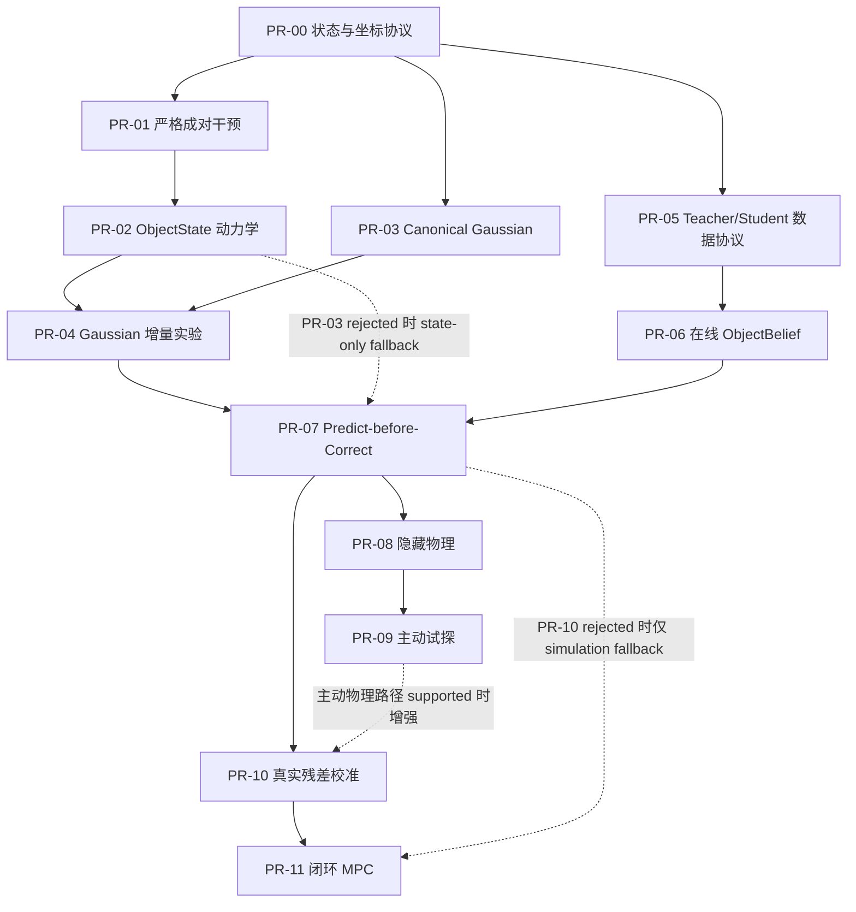

# ObjGauss 假设驱动实施路径

> 状态：Owner 已确认路径原则；实现细节等待前置决策
> 版本：0.3
> 日期：2026-07-14
> 上位需求：`PRD.md`
>
> 知识状态：
>
> - `decision`：实现 PR 按“一个 PR 只引入一个可证伪假设”拆分，不按数据集拆分。
> - `decision`：`PR-04` 是 Gaussian 是否进入 dynamics 核心的生死门。
> - `decision`：首个验收目标是面向研究评审的 Demo A；必须接受 `PR-04` 的支持或否定结论。
> - `decision`：`PR-04` 的唯一 primary endpoint 是 held-out sibling groups 上的多步
>   `effect-vs-hold` ObjectState 预测误差。
> - `decision`：该 endpoint 使用 group-first paired aggregation；每个 sibling group 等权，
>   不能让 episode 长度或非目标对象数量隐式改变裁决权重。
> - `decision`：稳定增益要求相对两个非 Gaussian 基线的 paired hierarchical bootstrap
>   95% 置信区间下界都超过预先冻结的最小实际增益 `δ`。
> - `decision`：`δ` 由与最终 test 完全隔离的 pilot 估计 evaluator 噪声和跨 seed 波动后
>   冻结；pilot 不进入最终统计，最终结果可见后不得调整 `δ`。
> - `decision`：多步 horizon 按物理时间覆盖动作执行和固定 post-action settling，不使用
>   simulator steps；具体时长和评分点由与最终 test 隔离的 pilot 冻结。
> - `decision`：`PR-04` primary endpoint 只使用 `hold + push` cohort；`grasp/lift` 使用
>   duration-matched hold，作为独立 secondary cohort。
> - `decision`：primary error 覆盖位置、按对象对称性校正的朝向、线速度和角速度；各分量
>   使用独立 pilot 产生的尺度归一化并冻结权重。
> - `decision`：每类状态误差除以 pilot robust scale 与 evaluator noise floor 的较大者；
>   归一化后位置、朝向、线速度和角速度各占 primary scalar 的 25%。
> - `decision`：多对象场景的 primary endpoint 只评估 `Intervention.target_id` 指向的直接
>   干预对象；其他对象的碰撞传播和 collateral effects 只作 secondary metrics。
> - `decision`：final test 完整留出 object identities、scene layouts 及其 sibling groups；
>   push 类型、方向和力度范围在 train 中有覆盖，不把 action extrapolation 混入主裁决。
> - `decision`：held-out 对象的 Gaussian 与 point cloud 共享同一冻结的 pre-intervention
>   多视角 oracle context、原始证据和采样预算；禁止 post-action/future 信息。
> - `decision`：`PR-03` builders 按版本/hash 冻结并离线生成 artifacts；`PR-04` 使用容量匹配
>   adapters 和相同 dynamics backbone，梯度不得回传 builders。
> - `decision`：三个 primary arms 匹配总可训练参数量、数据曝光、optimizer updates、batch
>   policy 和调参预算；FLOPs、显存与延迟报告但不强制相等。
> - `decision`：在继续 grill-me 前先交付直接渲染 3D Gaussian 的 Stage-0 页面，不使用
>   notebook，并允许下载 REFERENCES.md 登记的固定小型 `.splat`；该切片不计作 `PR-00`
>   contract、训练结果或研究 verdict。
> - `decision`：Stage-0 只做 Web，并以可自由浏览的环境级 Gaussian scene 为默认体验；不得用
>   单物体加假地面网格包装成“世界”，也不得伪造 `PR-00` episode、坐标轴或轨迹。
> - `working_assumption`：ManiSkill、HO-Cap、RH20T 等具体来源，分支名、建议源码路径、
>   模型家族和未冻结数值阈值；`RES-001` 可以用更合适的获批来源替换。
> - 当前只有 Stage-0 预览切片在本地实现；本文不表示 `PR-00`–`PR-11` 已创建、提交或通过。

## 1. 路径结论

数据集是证据来源，不是 PR 的所有权边界。每个实现 PR 必须回答一个能被实验否定的问题：

1. 假设是什么；
2. 什么观察会支持或否定它；
3. 使用什么简单基线与固定拆分；
4. 失败后停止、降级还是改走哪条路径；
5. 哪个可复现 Demo 让结果可观察。

每个 PR 在实现前冻结一个 primary endpoint 和裁决方向；secondary metrics 用于解释机制，
不能在 primary endpoint 失败后临时改成“成功依据”。

`PR-00` 到 `PR-11` 的依赖关系如下：



`PR-04` 的结果只决定 Gaussian 的职责，不决定项目是否整体停止：

- 有稳定增益：Gaussian feature 可以进入后续 dynamics。
- 无稳定增益：保留 `PR-03`，将 Gaussian 固定为视觉记忆与 renderer；后续 dynamics 使用
  ObjectState，不用“渲染更漂亮”替代预测或规划增益。

## 2. 当前本地事实与开工前置门

当前目录 **是有效 Git worktree**。除规划文档外，工作区已有一个无生产依赖的 Stage-0
WebGL2 3D Gaussian world viewer、确定性 synthetic scene generator、固定审计样例下载脚本和
Node 行为测试；本地 ignored `data/` 中已有经大小与哈希核验的 103,060-record `.splat`。它们
不是模型源码、原始训练数据、训练好的 3DGS 结果或机器 contract。Owner 材料中“不是有效
Git worktree、需要先同步仓库”的描述与本地事实冲突，已按实际工作区修正：无需再次同步旧
项目，也不得整体恢复归档。

正式开始 `PR-00` 前仍需完成以下非研究前置门；它们不占用 `PR-00` 至 `PR-11` 编号：

| 前置项 | 唯一目标 | 通过条件 |
| --- | --- | --- |
| `DOC-000` | 固化 PRD、假设路径、资源边界和协作规则 | Owner 接受或明确修改点 |
| `DEC-001` | 确定新项目许可证、claim policy 和归档移植权限 | Owner 动作级批准 |
| `RES-001` | 核验首批所需来源；仅固定 Stage-0 预览获准下载 | 全部核心来源的上游版本、许可、字段、规模和预算可审计；当前仅局部完成 |
| `ADR-001` | 冻结 Stage-0 最小预览栈；训练/模型栈后续另决策 | `docs/adr/0001-stage-0-preview-stack.md` 与 `AGENTS.md` 命令一致 |

Owner 已明确批准的 Stage-0 页面是前置可见切片，不改变核心门：不得由此偷跑 schema、训练
框架、原始数据集下载或模型训练。

### Stage-0 可见切片（当前本地实现）

**可观察目标**：研究/工程贡献者能在本地打开全屏页面，从环境内部自由环绕、平移、移动、
缩放并重置一个含地形、路径、建筑、树和环境粒子的 synthetic 3D Gaussian world；默认首屏
不得暴露完整底板边缘或形成外部俯视展台。同时可切换固定外部审计样例或本地 `.splat`，并
看到来源、许可状态、SHA-256、splat 数量、格式与禁止声明。外部数据留在 ignored 目录。

**验收边界**：synthetic world 固定为 272,736 bytes、8,523 records 和 SHA-256
`4782f6ed4816aee54618bb4d1fcbce8df67e65301e23a89c155985084f51cfe6`；固定
外部 `.splat` 的 3,297,920 bytes、103,060 records 与 SHA-256 也必须匹配。解析器必须拒绝坏
长度、绝对值超过 `1,000,000` 的位置、超过 `10` 的输入尺度、在最大 32× 显示尺度下不能保持
finite float32 的 covariance、无效 quaternion 和全透明文件。渲染分辨率单边限制为 `4,096`
像素；GPU 上传与深度排序前以 bounds center 统一重定位到 renderer-local 坐标（不构成
`PR-00` 坐标约定）；screen covariance 的 2×2 特征值使用缩放后的稳定计算。首个深度排序和
首个无 WebGL error 的 draw 完成前不得显示
`ready` 或肯定渲染声明；WebGL2、shader、worker、哈希、纹理
上传、排序或首帧失败时页面必须清空旧场景并显示 `blocked`，不得降级为 point sprite。
synthetic world 是 viewer fixture，不是 `PR-00` episode、坐标 contract 或模型输出；该结果不
解锁 `PR-01`，也不支持 FR-001/FR-002、坐标正确、训练好的 3DGS 重建、对象状态或动力学能力。

## 3. PR 结果语义

“PR 完成”和“假设被支持”是两件事：

| 结果 | 含义 | 后续 |
| --- | --- | --- |
| `supported` | 固定协议下，预注册门槛和基线比较支持假设 | 解锁声明过的下游依赖 |
| `rejected` | 实验有效，但结果否定假设 | 合并可复现负证据；执行停止/降级路径 |
| `blocked` | 数据、许可、实现或评估不足以裁决 | 不得记为 0、fail 或 pass；先解除 blocker |
| `invalid` | 泄漏、split、基线、指标或复现协议无效 | 结果作废，修复实验根因后重跑 |

基础 contract/invariance PR 必须通过其正确性门才能成为下游依赖。研究实验 PR 可以保留
`rejected` 结果，但不能借合并代码把研究假设写成 `supported`。报告必须暴露失败 scene、
warning、fallback 和未运行项。

## 4. PR-00：状态、干预与坐标协议

**可证伪假设**

一个显式记录坐标方向、单位、来源与置信度的最小 contract，能使合成 episode 的状态、干预
和投影在机器审计下保持一致。

**最小范围**

- 定义 `T_WC`、`T_WO`、`T_OC` 的方向、作用对象、左右手系和单位。
- 定义 Observation、ObjectBelief、Intervention 与 CausalLineage 的机器 schema。
- 定义姿态评估所需 object symmetry metadata 的来源、表示、缺失语义和 round-trip 行为；
  具体机器字段由本 PR 冻结，不从数据集名称或 mesh 外观隐式猜测。
- 每个观测/状态值能追溯 `value / confidence / source`；缺失使用显式语义。
- 提供一个合成 episode 和最小同步查看工具。
- 不包含模型训练。

**裁决门**

- 投影与反投影往返通过冻结容差。
- 合成重投影误差的候选门为小于 1 像素；正式统计量和阈值由 `PR-00` pilot/Owner 冻结。
- 测试能捕获坐标方向、单位和 OpenCV/OpenGL convention 错误。
- schema 的 producer、consumer、版本、必填/可选和 round-trip 行为明确。

**失败路径**

任何坐标或 contract 不一致都阻塞 `PR-01`、`PR-03` 和 `PR-05`，只修根因，不以 adapter
补丁掩盖。

**Demo**

播放一个合成 episode，同步显示 RGB、3D 对象、相机、坐标轴和轨迹。

## 5. PR-01：严格成对干预（ManiSkill 候选）

**可证伪假设**

一个经 `RES-001` 批准的可控仿真器能从同一 snapshot 生成严格可比的 sibling branches，
除声明的干预外不改变初态、相机、光照、物理参数或随机状态。ManiSkill 是当前候选，不是
预先锁定的来源。

**最小范围**

每个起点的 primary push cohort：

```text
hold
push(+x, weak)
push(+x, strong)
push(-x, weak)
push(+y, weak)
```

`grasp/lift` 使用同类起点，但与 duration-matched hold 组成独立 secondary cohort；它不进入
`PR-04` primary endpoint。

每条分支记录：

```text
snapshot_id
sibling_group_id
branch_id
changed_variable
commanded_action
executed_action
physics_parameters
contact_events
reset_seed
```

**裁决门**

- 干预前状态、相机、光照、随机种子和未声明物性一致。
- 每个 sibling 只改变 `changed_variable` 声明的变量。
- train/validation/test 按 `sibling_group_id` 整组隔离；同一 object identity 或 scene layout
  不得跨 final split 边界复用。
- final test 完整留出 object identities 与 scene layouts；primary push 类型、方向和力度范围
  在 train 中有覆盖并跨 split 分层保持支持。
- 相同 seed 的 snapshot/state/render hash 满足冻结的 determinism policy。

**失败路径**

若 approved simulator 无法满足 reset 或 sibling invariance，`PR-02` blocked；保留生成器与
审计负证据，回到 simulator/动作定义选择，不用随机视频或近似初态替代严格 sibling。

`grasp/lift` 与 push 不共用 primary 统计。若无法构造 duration-matched hold 或满足独立
cohort invariance，只阻塞该 secondary cohort，不为凑六分屏放宽 primary push invariance。

**Demo**

primary push cohort 用五联分屏回放；secondary 区域单独并排显示 `grasp/lift` 与其
duration-matched hold，并显示各自 lineage diff。

## 6. PR-02：ObjectState-only 动力学基线

**可证伪假设**

在完全不使用 Gaussian 的条件下，action-conditioned ObjectState 模型能比 copy-state、
constant-velocity 和 action-free predictor 更准确地预测干预效果。

**输入输出**

```text
(S_t, a_t) -> predicted S_(t+1)
```

候选模型可以是最小 Object GNN，但模型家族由后续模型/训练 ADR 与本 PR 预注册规格决定，
不因附件中的建议路径或 Stage-0 ADR-001 自动获批。

**裁决门**

- 同时报告一步、多步和 `effect-vs-hold`，不只报告下一帧平均误差。
- `push(+x)` 与 `push(-x)` 的预测效果方向正确。
- action-conditioned 胜 copy、constant-velocity 和 action-free 基线。
- action shuffle 后性能按预注册门槛显著退化。
- 固定数据、参数预算、seed 和 object/scene/sibling split；final test 的 object identities
  与 scene layouts 不得出现在 train/validation，动作支持范围保持一致。

**失败路径**

若最小 action-conditioned baseline 不成立，不进入 Gaussian dynamics 比较；保留负结果并先
诊断状态、动作或数据 contract。

**Demo**

显示动作箭头、各基线预测轨迹、真实轨迹和 effect-vs-hold residual。

## 7. PR-03：Canonical Object Gaussian

**可证伪假设**

在 GT identity、mask、depth 和 pose 下，canonical object Gaussian 能形成与背景解耦、可刚性
变换、随新视角补全且优于单帧点云的视觉记忆。

**最小范围**

```text
G_world(i,t) = T_WO(i,t) * G_canonical(i)
```

只验证视觉表示，不训练动力学。

为 `PR-04` 输出 paired representation artifact：Gaussian 与 point cloud 必须来自同一冻结的
pre-intervention 多视角 oracle context，并共享原始帧、视角、深度、GT identity/mask/pose
和采样预算。context manifest 记录时间边界、输入校验和与预算。

Gaussian/point-cloud builders 的版本、配置和 hash 是 artifact manifest 的组成部分；进入
`PR-04` 后 builders 与既有 artifacts 均为 immutable，不接受 dynamics loss 回传。

**裁决门**

- 对象与背景 ownership 污染低于预先冻结的指标阈值。
- 改变 pose 时对象按刚体变换，背景保持不变。
- held-out camera 渲染优于同预算的单帧点云基线。
- 逐视角几何覆盖按协议改善。
- 对称物体、严重遮挡和错误 pose 的失败案例必须展示。
- `supported` 要求 ownership、刚性变换、held-out baseline 和预注册几何补全门全部通过；
  symmetric/occlusion 等 hard cases 用于解释，不得单独救活失败 verdict。

**失败路径**

视觉表示失败时，`PR-04` 的 report verdict 记为 `blocked`，并用路线元数据记录
`not_applicable_reason=pr03_rejected`；保留失败证据。ObjectState-only 研究线可在 `PR-06`
身份门通过后旁路进入 `PR-07`，但后续不得再声称使用 Gaussian 视觉记忆或 dynamics 增益。

**Demo**

第一帧局部对象、新视角补全、独立移动和 held-out camera 四联展示。

## 8. PR-04：Gaussian 增量价值生死实验

**可证伪假设**

在控制数据、参数预算和 seed 后，Gaussian 表示相对 ObjectState 与 point cloud，在 held-out
`hold + push` sibling groups 上 target object 的多步 `effect-vs-hold` ObjectState 预测误差
中提供稳定增益。

**严格对照**

1. ObjectState-only；
2. ObjectState + point cloud；
3. ObjectState + Gaussian；
4. Gaussian-only。

**裁决门**

- primary endpoint 固定为 held-out sibling groups 上的多步 `effect-vs-hold` ObjectState
  预测误差。
- primary action cohort 只包含 `hold + push`；`grasp/lift` 是使用 duration-matched hold 的
  独立 secondary cohort，不得进入或救活 primary verdict。
- final test 完整留出 object identities、scene layouts 及其 sibling groups；push 类型、方向
  和力度范围在 train 中有覆盖。未见动作外推不属于本 PR 的 primary claim。
- held-out 对象的 Gaussian 与 point cloud 由同一冻结的 pre-intervention 多视角 oracle
  context 构建，共享原始帧、视角、深度、GT identity/mask/pose 和采样预算。
- context manifest 必须证明没有 post-action frame、目标 rollout future 或额外视角预算；
  任一表示获得额外信息时结果为 `invalid`。
- Gaussian/point-cloud builders 按版本和 hash 冻结，离线 artifacts immutable；`PR-04`
  训练不得把任何梯度回传 builders。
- 两种表示分别使用容量匹配的可学习 adapter，并共享同一 dynamics backbone、输出头和训练
  协议。端到端重训只能作为 secondary experiment，不能进入 primary verdict。
- ObjectState-only、ObjectState + point cloud 与 ObjectState + Gaussian 在预注册容差内
  匹配 adapter + backbone 总可训练参数量，并共享数据曝光量、optimizer updates、batch
  policy 和调参预算。
- FLOPs、峰值显存和推理延迟必须完整报告为资源 secondary metrics，但不作为本阶段的强制
  等价条件。
- primary error 只聚合位置、按 object symmetry metadata 校正的朝向、线速度和角速度；
  可见性、外观/渲染质量与接触事件是 secondary metrics。
- 多对象场景只评估 `Intervention.target_id` 指向的 target object；其他对象的状态误差、
  碰撞传播和 collateral effects 单独报告为 secondary metrics。
- 每类状态误差除以与 final test 隔离的 pilot 所估 robust scale 与 evaluator noise floor 的
  较大者；归一化后位置、朝向、线速度和角速度各占 primary scalar 的 25%。
- robust scale 与 noise-floor estimator 必须在 experiment spec 中冻结，看到 final test 后
  不得改 estimator、scale 或权重。
- 每个 sibling group 先跨冻结的 horizons 聚合 target object 的归一化轨迹误差，形成一个
  等权 group scalar；再以同一 group 上的模型差值做 paired comparison。episode 长度和
  非目标对象数量不得隐式增加该 group 的裁决权重。
- 对每个非 Gaussian 基线定义配对改进 `Delta_b = error_b - error_gaussian`，按冻结的数据层级
  与训练 seed 做 paired hierarchical bootstrap。
- `supported` 要求 ObjectState-only 与 ObjectState + point cloud 两个 `Delta_b` 的 95%
  置信区间下界都高于预先冻结的 `δ`；不设置事后 co-primary endpoints。
- `δ` 由与最终 test 完全隔离的 pilot 估计 evaluator 噪声与跨 seed 波动后冻结；pilot
  不进入最终统计，最终结果可见后不得调整。experiment spec 仍须预注册具体估计器和数值。
- rollout horizon 按物理时间从干预开始覆盖动作执行和固定 post-action settling；在
  预注册的物理时间点评分，不使用 simulator steps 定义门槛。
- 与最终 test 隔离的 pilot 必须冻结动作时长、settling 时长和评分点；最终结果可见后不得
  延长、缩短或选择性删除时间点。
- experiment spec 还须冻结 robust/noise estimator、归一化尺度、组内权重和 bootstrap 细节。
- 同时报告一步/多步 ObjectState error、数据效率和 push-to-target 成功率，但它们均为
  secondary metrics，不得事后替代 primary endpoint。
- 统一 evaluator、训练预算、参数量容差、数据与随机 seed。
- 至少跨冻结的 scene split 和多 seed 报告效应量与不确定性。
- PSNR 或“渲染更漂亮”只能作辅助指标。

**硬决策**

- 稳定增益：允许 Gaussian feature 进入后续 dynamics。
- 无稳定增益：Gaussian 固定为视觉记忆和 renderer；后续主张不得暗示它改善 dynamics。
- 结果无效或 blocked：不做职责决策，先修复实验协议。

**Demo**

同一动作下四种表示的预测、误差和规划结果并排展示。

## 9. PR-05：离线 Teacher / 单目 Student 协议（HO-Cap 候选）

**可证伪假设**

在不泄漏未来或多视角信息给在线 student 的前提下，一个经 `RES-001` 批准的真实多视角
来源能提供可校验的离线 teacher、单相机在线输入和 held-out camera 评估协议。HO-Cap 是
当前候选，不是预先锁定的来源。

**最小范围**

- 多视角与完整视频仅供离线 teacher。
- 单相机因果流作为在线 student 输入。
- 其他相机作为 held-out validation。
- split 按对象、主体和完整视频划分，禁止随机 frame split。
- teacher state 携带来源、置信度、不确定性和生成版本。

**裁决门**

- 标定与跨视角重投影通过冻结门槛。
- 在线接口在结构和测试上无法读取未来帧、held-out camera 或 teacher-only 字段。
- teacher/GT/weak label 明确分栏，不把 teacher 伪装成物理真值。

**失败路径**

若许可、标定或因果接口无法成立，`PR-06` blocked；不以随机帧切分或未来平滑补救。

**Demo**

同一时刻展示在线单目输入、离线 teacher 3D 状态和 held-out camera。

## 10. PR-06：在线 ObjectBelief 与身份门

**可证伪假设**

只使用当前及历史单相机输入的在线 ObjectBelief，能在同一固定评估集上胜重新运行的简单
3D connected-components 基线，并在遮挡后保持身份与校准不确定性。

**对象状态机**

```text
NEW
VISIBLE
OCCLUDED
PREDICTED
REIDENTIFIED
INACTIVE
```

**裁决门**

- 同一数据、split 和 evaluator 下胜 3D connected-components。
- 单独报告 IDF1、ID switch、fragmentation、pose error、遮挡恢复率和 uncertainty calibration。
- 自动测试证明没有 future frame、teacher-only view 或 target pose 泄漏。
- 归档中的约 `0.755 vs 0.826` 只作历史诊断，不能跨数据集直接充当本 PR 数值门槛。
- `supported` 要求 same-set baseline improvement、零 future/teacher leakage，以及预注册的
  identity、pose、occlusion recovery 和 uncertainty calibration 关键门全部通过；任何泄漏
  都使结果 `invalid`。

**失败路径**

身份门不通过时，`PR-07`–`PR-09` 的真实在线路径 blocked；最多允许独立的 simulation-only
诊断，不形成在线或因果声明。保留失败报告并回到 association、teacher 或数据诊断，不放宽
门槛。

**Demo**

对象被遮挡时显示虚线 prior；重新出现后恢复原 ID，并显示 uncertainty 收缩。

## 11. PR-07：Predict-before-Correct

**可证伪假设**

强制在读取目标观察前持久化并评分 prior，可以把动力学误差、感知误差和 posterior correction
分开测量，而不是混成一个事后 loss。

**API 不变量**

```python
prior = predict(belief_t, action_t)
prior_ref = seal_prior(prior)
error = evaluator.score(prior_ref, observation_t1)
posterior = correct(prior_ref, observation_t1)
```

其中 `observation_t1` 只能在 `prior_ref` 已冻结后由独立 evaluator/corrector 读取；predictor
不能访问目标观测，corrector 也不能改写已封存 prior。

**裁决门**

- prior 在目标观测对模型可见前落盘并绑定 hash/timestamp。
- prediction、perception、correction metric 分开。
- evaluator 能检测“先看后预测”、未来平滑和 target leakage。
- `PR-04` 若拒绝 Gaussian dynamics，本 PR 继续使用 ObjectState dynamics；Gaussian 只渲染。
  若 `PR-03` 已拒绝且 `PR-04` 不适用，则完全省略 Gaussian。

**失败路径**

若 prior sealing、独立 scoring 或 loss 分账失败，`PR-08`–`PR-10` 的状态推断主张 blocked；
ObjectState dynamics 与在线 identity 可各自保留，但不能用 posterior 指标替代 prior 预测。

**Demo**

同时显示 prior future、真实下一帧、residual 和 posterior。

## 12. PR-08：隐藏物理状态

**可证伪假设**

从交互历史维护的物性 posterior，能在未见质量、摩擦与动作组合上胜无历史模型，且增益不是
由颜色、尺寸或纹理泄漏造成。

**候选隐变量**

```text
phi = mass, friction, restitution, compliance
q(phi_i | interaction_history)
```

首个实现可缩小变量集合；不得为一次 PR 同时引入无法独立验收的全部物性。

**裁决门**

- appearance-locked 数据与 property leakage test 通过。
- 在未见物性×动作组合上胜无历史基线。
- 报告 posterior NLL、calibration 和 prediction gain，不只输出点估计。
- 不可辨识时报告多解或 blocked，不伪造唯一物性真值。

**失败路径**

若模型不胜无历史基线、物性不可辨识或存在 appearance leakage，`PR-09` blocked；`PR-10`
仍可作为不声称 hidden physics 的通用 residual calibration 继续，但不得携带 latent-physics
或主动因果主张。

**Demo**

外观相同、质量不同的对象显示预测分布，并随交互历史更新。

## 13. PR-09：主动试探与信息增益

**可证伪假设**

在动作成本与风险受控时，信息增益 probe 比不试探、随机试探和固定力度试探更能降低物性
不确定性，并提高最终任务成功率。

**对照**

- no probe；
- random probe；
- fixed-strength probe；
- information-gain probe。

**裁决门**

- probe 后的预测误差和 NLL 按预注册门槛下降。
- information-gain 胜 random/fixed probe。
- 最终任务成功率提高，而不只是物性分类准确率提高。
- 报告动作成本、风险、失败 probe 和 calibration。

**失败路径**

若 information-gain probe 不胜随机/固定对照，主动试探假设为 `rejected`，不形成因果策略
主张；`PR-10` 可走 residual-only 旁路，但不能声称真实校准继承了主动辨识能力。

这是首个允许形成受控主动因果主张的 PR；`PR-08` 的被动 latent inference 不能提前替代它。

**Demo**

模型选择一次试探动作，更新物性 posterior，再执行目标任务。

## 14. PR-10：真实数据残差校准（RH20T 候选）

**可证伪假设**

在一个经 `RES-001` 批准的真实机器人来源、一个配置和一类 push/contact 任务上，小样本
residual/action calibration 比零样本 sim、commanded-only 和同预算全模型微调更有效，并能
泛化到未见对象或轨迹。RH20T 是当前候选，不是预先锁定的来源。

**首版边界**

- 只使用经 `RES-001` 批准的最小真实子集。
- DROID、Open X-Embodiment 和大规模真实预训练不进入本 PR。
- commanded 与 executed action 分开。
- `0/10/50/200` 是候选 few-shot ladder；最终点位由资源预算与 Owner 在本 PR spec 中冻结。
- 最终研究结论仍需少量自有严格控制真实干预。

**模型分解**

```text
S_(t+1) = F_sim(S_t, a_t, phi) + Delta_real(S_t, a_t)
```

**裁决门**

- residual calibration 胜零样本、commanded-only 和同预算全模型微调。
- 提升在未见对象/轨迹的完整 split 上成立。
- 报告 executed-action coverage、接触失败和 calibration uncertainty。

**失败路径**

若 residual calibration 不胜基线，真实校准假设为 `rejected`；`PR-11` 只允许
simulation-only MPC，不得执行或声称真实闭环价值。若来源缺 executed action 或合法用途，
结果为 `blocked`，不能退回 commanded-only 冒充校准。

**Demo**

按本 PR 最终批准的 few-shot ladder 并排展示预测与残差；`0/10/50/200` 仅作候选版式。

## 15. PR-11：闭环 MPC

**可证伪假设**

在统一动作预算与安全约束下，使用经过校准的动作条件世界模型做闭环 MPC，能在预注册的
任务 primary endpoint 或组合效用上胜 action-free、pure behavior cloning 和简单
ObjectState-only 基线。

**循环**

```text
observe
-> update belief
-> generate action candidates
-> predict branches
-> score
-> execute
-> observe and correct
```

**最终对照**

- ObjectState-only MPC；
- ObjectState + Gaussian MPC，仅当 `PR-04` supported；
- action-free world model；
- pure behavior cloning；
- oracle-state MPC 上界。

**裁决门**

- 在 experiment spec 中预注册一个 primary endpoint 或组合效用；`supported` 必须按冻结的
  方向、效应阈值和 multiplicity policy 通过，其他指标不能事后救活。
- 从任务成功率、碰撞数、动作次数、执行时间和 calibration error 中预注册 primary endpoint
  或组合效用，并完整报告其余 secondary metrics。
- 统一任务、动作候选预算、控制频率和安全限制。
- 人为扰动后能重新观测与规划；失败恢复可审计。
- PSNR 只能作辅助指标。
- 真实机器人执行前必须另过独立安全门。

**失败路径**

若 primary endpoint 不胜必需基线，闭环价值假设为 `rejected`；保留任务级失败报告，
Gaussian 只能维持此前已通过的视觉或预测职责，不能宣称提高规划价值。安全门未通过时只能
做仿真/离线 replay，状态为 `blocked`。

**Demo**

点击目标位置，显示候选 rollout，执行最佳动作；人为扰动后重新规划。

## 16. 四个可展示版本

| Demo | 覆盖 PR | 可展示结论 | 不能声称 |
| --- | --- | --- | --- |
| A | `PR-00`–`PR-04` | Gaussian 是否对预测/简单规划有增量价值 | 真实在线身份或因果规划 |
| B | `PR-05`–`PR-07` | 在线对象信念、遮挡恢复和 predict-correct 分账 | 隐藏物理成立 |
| C | `PR-08`–`PR-09` | 隐藏物理 posterior 与主动试探 | sim-to-real 或真实闭环价值 |
| D | `PR-10`–`PR-11` | 少量真实校准和闭环规划 | 未测机器人、任务或安全域泛化 |

## 17. 每个实现 PR 的统一交付合同

每个 PR 必须提供：

1. 一句话可证伪假设和明确 falsifier；
2. 依赖、输入、输出、范围外与停止/降级路径；
3. 固定数据版本、完整 scene/sibling split、seed 和简单 baseline；
4. 指标、阈值、统计口径与 claim policy；
5. 一个预注册 primary endpoint；secondary metrics 不能事后替代裁决；
6. 行为级测试和一个小型固定 fixture；
7. 机器可读 report，状态为 supported/rejected/blocked/invalid；
8. 一条可复现生成 Demo 的命令；
9. 对应 experiment spec，记录配置、环境、资源和失败样例。

建议逻辑产物：

```text
docs/experiments/PR-XX.md
configs/experiments/pr_xx.yaml
tests/
small fixed-seed fixture
report.json
demo command
```

这些是逻辑交付，不是已批准目录。准确源码根、包名、配置格式和命令由后续模型/训练 ADR
冻结；Stage-0 ADR-001 不批准这些选择。该决策前不要创建附件建议的
`src/objgauss/...` 空框架。

## 18. 建议分支与责任域

分支名是 `working_assumption`，实际创建分支仍需 Owner 的 Git 动作授权。

| PR | 建议分支 | 单一责任域 |
| --- | --- | --- |
| `PR-00` | `pr/00-core-contracts` | contracts、frames、projection、episode viewer |
| `PR-01` | `pr/01-maniskill-siblings` | approved simulator adapter、sibling writer、invariance |
| `PR-02` | `pr/02-state-dynamics` | state baselines、action-conditioned dynamics、metrics |
| `PR-03` | `pr/03-canonical-gaussian` | canonical representation、fusion、renderer evaluation |
| `PR-04` | `pr/04-gaussian-ablation` | controlled representation ablation 与决策报告 |
| `PR-05` | `pr/05-hocap-adapter` | approved multiview adapter、teacher/student boundary |
| `PR-06` | `pr/06-online-object-belief` | association、pose filter、online identity |
| `PR-07` | `pr/07-predict-correct` | prior、scoring、corrector 与 leakage audit |
| `PR-08` | `pr/08-latent-physics` | latent physics、posterior、property leakage |
| `PR-09` | `pr/09-active-probing` | probe policy、information gain、task metrics |
| `PR-10` | `pr/10-real-calibration` | approved real-data adapter、residual/action calibration |
| `PR-11` | `pr/11-closed-loop-mpc` | MPC、action sampling、costs、click-to-push demo |

## 19. 仍待 Owner 确认

实现路径原则和首个验收目标已经确认：先面向研究评审交付 Demo A。以下前置决策仍未完成：

- 新项目许可证与允许移植的归档文件；
- 最小技术栈、目录、落盘格式、包管理和 CI；
- 首阶段磁盘、下载、算力和最长验收时间预算；
- 各 PR 的正式数值阈值、统计检验和资源预算；
- 目标机器人、动作空间、控制频率和安全规范。

Gaussian 是否进入 dynamics 不再要求 Owner 预先选择，由 `PR-04` 的预注册实验裁决。

## 20. 下一步

当前工作区无需同步旧仓库。顺序更新为：

1. 运行并评审 Stage-0 本地页面及其证据边界；
2. 完成 `DOC-000`、`DEC-001` 和其余 `RES-001`，把 ADR-001 之外的训练/模型栈另行冻结；
3. 仅在核心前置门通过后开始 `PR-00` 机器 contract 与坐标门；
4. 不借 Stage-0 授权提前创建训练框架、公共 schema、模型依赖或大型数据副本。
